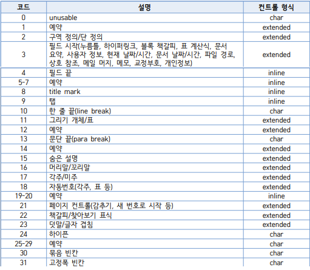

# python-hwp

python-docx 와 비슷한 방식으로 전처리를 위해 커스터마이징 한 HWP 파일 파서입니다.
현재는 데이터 머신러닝 목적으로 작성하였습니다.

[HWP 파일 포맷](https://www.hancom.com/etc/hwpDownload.do)
을 참고하였으며 현재는 HWP 5.0 형식만 지원합니다.

- 2020-10-24 Paragraph parsed.

## Example

```python
from main import extract
extract('example.hwp')
```

```
control=2 info=b'dces\x00\x00\x00\x00\x00\x00\x00\x00' text=
control=2 info=b'dloc\x00\x00\x00\x00\x00\x00\x00\x00' text=
control=13 info=b'' text=HWP test file
control=13 info=b'' text=Purpose: Provide example of this file type
control=13 info=b'' text=Document file type: HWP
control=13 info=b'' text=Version: 1.0
control=13 info=b'' text=Remark:
control=13 info=b'' text=Example content:
control=11 info=b' osg\x00\x00\x00\x00\x00\x00\x00\x00' text=
control=13 info=b'' text=The names "John Doe" for males, "Jane Doe" or "Jane Roe" for females, or "Jonnie Doe" and "Janie Doe" f
or children, or just "Doe" non-gender-specifically are used as placeholder names for a party whose true identity is unknown or m
ust be withheld in a legal action, case, or discussion. The names are also used to refer to acorpse or hospital patient whose id
entity is unknown. This practice is widely used in the United States and Canada, but is rarely used in other English-speaking co
untries including the United Kingdom itself, from where the use of "John Doe" in a legal context originates. The names Joe Blogg
s or John Smith are used in the UK instead, as well as in Australia and New Zealand.
control=13 info=b'' text=John Doe is sometimes used to refer to a typical male in other contexts as well, in a similar manner to
 John Q. Public, known in Great Britain as Joe Public, John Smith or Joe Bloggs. For example, the first name listed on a form is
 often John Doe, along with a fictional address or other fictional information to provide an example of how to fill in the form.
 The name is also used frequently in popular culture, for example in the Frank Capra film Meet John Doe. John Doe was also the n
ame of a 2002 American television series.
control=13 info=b'' text=Similarly, a child or baby whose identity is unknown may be referred to as Baby Doe. A notorious murder
 case in Kansas City, Missouri, referred to the baby victim as Precious Doe. Other unidentified female murder victims are Cali D
oe and Princess Doe. Additional persons may be called James Doe, Judy Doe, etc. However, to avoid possible confusion, if two ano
nymous or unknown parties are cited in a specific case or action, the surnames Doe and Roe may be used simultaneously; for examp
le, "John Doe v. Jane Roe". If several anonymous parties are referenced, they may simply be labelled John Doe #1, John Doe #2, e
tc. (the U.S. Operation Delego cited 21 (numbered) "John Doe"s) or labelled with other variants of Doe / Roe / Poe / etc. Other
early alternatives such as John Stiles and Richard Miles are now rarely used, and Mary Major has been used in some American fede
ral cases.
control=11 info=b' osg\x00\x00\x00\x00\x00\x00\x00\x00' text=
control=13 info=b'' text=
control=3 info=b'klh%\x00\x00\x00\x00\x00\x00\x00\x00' text=File created by
control=4 info=b'klh\x00\x00\x00\x00\x00\x00\x00\x00\x00' text=http://www.online-convert.com
control=13 info=b'' text=
control=3 info=b'klh%\x00\x00\x00\x00\x00\x00\x00\x00' text=More example files:
control=4 info=b'klh\x00\x00\x00\x00\x00\x00\x00\x00\x00' text=http://www.online-convert.com/file-type
control=13 info=b'' text=
control=3 info=b'klh%\x00\x00\x00\x00\x00\x00\x00\x00' text=Text of “Example content”:
control=4 info=b'klh\x00\x00\x00\x00\x00\x00\x00\x00\x00' text=Wikipedia
control=13 info=b'' text=
control=11 info=b' osg\x00\x00\x00\x00\x00\x00\x00\x00' text=
control=3 info=b'klh%\x00\x00\x00\x00\x00\x00\x00\x00' text=License:
control=4 info=b'klh\x00\x00\x00\x00\x00\x00\x00\x00\x00' text=Attribution-ShareAlike 3.0 Unported
control=13 info=b'' text=
control=13 info=b'' text=Feel free to use and share the file according to the license above.
```

